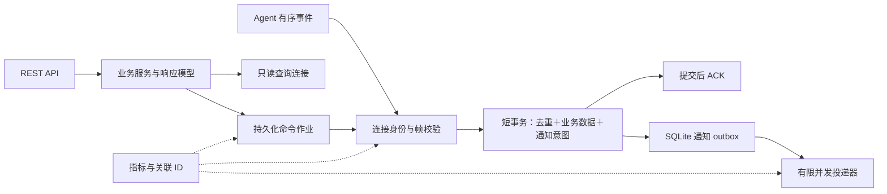
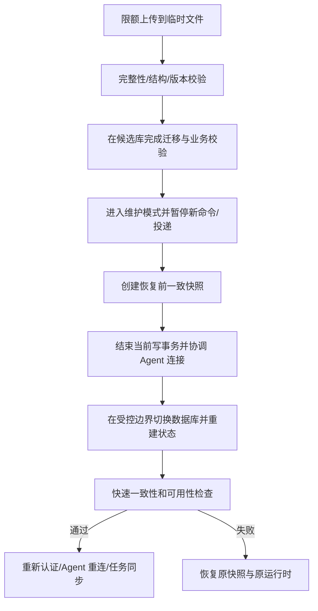

# 后端详细优化方案

基线与验证结果见[方案总览](optimization-plan.md)。范围包括中心 Server，以及直接影响前后端命令和数据一致性的 Agent 协议边界。问题证据以分析基线为准；后续实现与验证记录在对应编号下，未标注完成的步骤仍为待办。

## 1. 设计原则与目标结构

继续保留单进程网关和 SQLite 作为默认部署。先修复连接所有权与业务身份，再补齐持久化异步工作和可观测性；不把线程数量、数据库更换或服务拆分作为吞吐改善的替代指标。

当前代码已经正确地把 `ingested` 与业务事件写入放进同一个 `BEGIN IMMEDIATE` 事务；CSV 使用独立只读连接，历史曲线做时间桶聚合。这些能力应作为后续改动必须保留的基础。

拟议运行结构：



## 2. B01：修复连接所有权与协议状态机

优先级：P0。定位：[gateway.py](../server/src/hub_server/gateway.py)，`serve():180`、`_register():256`、`_unregister():299`、`_resolve_command():713`。

### 已确认问题

收到 hello 时，代码先把候选 ID 赋给局部 `agent_id`，再判断该 ID 是否已经连接。冲突分支关闭新连接并 return，但 finally 仍执行 `_unregister(agent_id)`，把原连接从 registry 移除并标记离线。隔离复现结果已确认原连接登记消失。

同一连接也未明确禁止第二次 hello；若第二次使用不同 ID，旧登记可能失去正确清理。当前 `_pending` 仅以 cmd_id 映射 Future，结果解析没有绑定来源 Agent，未来作业化应一并收敛所有权。

### 实施步骤

1. 将候选身份与成功注册身份分开。连接仅在注册成功后获得 registry 所有权。
2. registry 保存不可复用的 connection generation/对象引用。finally 只在 `connections[id]` 仍为当前对象时清理，拒绝的新连接不得清理其他会话。
3. 引入 `awaiting_hello → registered → closing` 状态机；首帧超时、重复 hello、错误类型明确关闭码，关闭前不修改其他连接状态。
4. pending command 同时保存 agent_id、connection generation 和 operation ID；仅接受匹配来源的结果。断连时结束等待并将执行结果标为未知或可确认失败，不能长时间保留无归属 Future。
5. 帧大小、hello 设备数量、字符串长度、seq 类型和合法范围显式校验。`bool` 在 Python 中属于 int 的情况也应排除。保留已约定的未知事件兼容策略，不能直接修改成拒绝所有未来类型而不升级协议。

### 验收

- 第二个同 ID 连接收到 4003，原连接仍能收事件、发 ACK 和执行命令，数据库在线状态不变。
- 同一连接重复 hello 或改 ID 不留下残余 registry。
- A Agent 的命令结果不能完成 B Agent 的 pending command。
- 原连接断开与新连接建立交错时，旧 finally 不能移除新连接。

变更可先独立发布，通常无需数据库迁移；保持既有关闭码兼容性。

## 3. B02：统一设备唯一身份

优先级：P0，多 Agent 同名设备时触发。定位：[db.py](../server/src/hub_server/db.py) 的 `UNIQUE(agent_id,name):163`；[api.py](../server/src/hub_server/api.py) 的历史与 `/devices/{name}`；[gateway.py](../server/src/hub_server/gateway.py) 的 `agent_for_device():755`、`tasks_for():766`。

### 已确认问题

数据库唯一键是 `(agent_id,name)`，但外部 API、发送短信、AT 和任务默认路由只提供 name。`agent_for_device()` 在连接列表中返回首个同名设备；单设备历史 `SELECT id WHERE name=?` 也取首个结果。全设备历史按 `d.name` 分组并以名称为字典 key，会把不同 Agent 同名模块混为一组。

### 方案

- 浏览器和 REST 使用 `device_id`；Server 查到设备记录后生成明确的 `{agent_id, device_name}` 内部目标。设备名仅作显示和 Agent 内部寻址。
- 短期兼容旧 name 端点：仅在全局唯一时解析；出现歧义返回 409 和可选择的设备摘要，禁止猜测目标。设备 ID 路由使用明确前缀或新版本，避免与旧字符串路径相互覆盖。
- 历史按 `device_id` 分组，响应以设备 ID 为 key 或返回带 ID 的数组。前端曲线、详情、busy、缓存和 select value 一并迁移。
- tasks 保存显式 device_id/agent_id；创建、更新时验证 SIM 与目标设备关系。现有 `agent_id=''` 的任务先尝试唯一回填，歧义记录暂停并进入待处理列表，不能静默分配。
- 已有消息保留历史 `agent_id/device` 和 SIM 关系，避免重命名后历史丢失。新增外键前先清点孤立记录和历史兼容策略。

### 验收与迁移

两台 Agent 各有 `modem-1`：分别查询历史、刷新、切换射频、发送 mock 短信和运行任务，目标必须准确。旧 name 请求存在歧义时明确失败。提供兼容窗口及迁移报告，数据库迁移前继续使用现有快照机制。

## 4. B03：查询范围、分页与已读契约

优先级：SIM 隔离为 P0，分页和已读为 P1。定位：[api.py](../server/src/hub_server/api.py) `list_messages():608`、`list_conversations():634`、`mark_read():679`；[db.py](../server/src/hub_server/db.py) `conversations():1743`、`mark_read():1804`、`_message_filter():1849`。

### 4.1 显式 SIM 过滤

当前 `_message_filter(sim_id=None)` 表示全部 SIM，而 `mark_read(sim_id=None)` 表示 `IS NULL`。前端打开无 SIM 会话会省略参数，隔离复现已确认会混入其他卡的同号码短信。

建议保持旧列表“省略代表全部”的行为，新加互斥的 `sim_scope=unassigned`；指定 sim_id 表示特定卡。请求模型拒绝 `sim_id` 与 unassigned 同时出现。Service 层统一构建条件，正文、总数、已读、导出必须使用同一条件对象。

这属于单管理员界面的业务数据隔离错误，不把它描述成已经存在的多租户越权。对于多 Agent 都没有 SIM 的消息，后续可用设备身份细化会话键；应先补齐确定的 null 语义问题。

### 4.2 分页与响应体

当前消息列表采用 `LIMIT/OFFSET`，上限 2,000；会话列表默认 200、最高 1,000，无 offset/cursor。长会话需要单独的游标接口，而非不断提高 limit。

拟议接口语义：

| 查询 | 参数/返回 | 一致性要求 |
| --- | --- | --- |
| 会话历史 | `before=(ts,id)`、`limit`；`items,next_cursor,has_more` | 排序与 cursor 相同，时间相同时以 ID 决定顺序 |
| 会话新增 | 最近插入 ID/事件版本，或尾页重新验证 | 不能只靠短信 ts：迟到短信时间可能早于已有消息 |
| 回执变化 | 变更版本或可见消息 ID 的状态增量 | 老消息状态改变不能被“只取新 ID”遗漏 |
| 会话摘要 | 游标、过滤、has_more；需要时返回 total | 新消息导致排序前移时由客户端按会话身份去重 |
| 普通日志 | 保留 offset；需要稳定翻页时增加快照上界或 cursor | 页码查询和导出语义分别明确 |

cursor 绑定过滤条件和排序版本，严格解析长度与格式；无须为单管理员系统过度设计权限票据。消息列表使用精简响应模型，原始 PDU 及完整诊断通过详情获取。

`items` 与 `total` 当前为两次独立读取，写入交错可能短暂不一致。需要严格一致时使用只读快照事务；无限滚动可优先返回 has_more，避免每 5 秒 count 全历史。

### 4.3 已读水位

给已读请求增加 `through_id` 或明确 ID 集合，并包含同样的会话身份。先定义“打开会话即读至当前水位”还是“可见消息已读”，前端再实现，不在 fetcher 中隐式决定。

验收：无 SIM/指定 SIM/全部的查询结果不同；10,000 条历史完整访问；插入相同时间戳、迟到消息和回执更新时不漏数据；读取后到达的新消息仍保持未读。

## 5. B04：去重期限、序列代际与断电持久性

优先级：P0。定位：[db.py](../server/src/hub_server/db.py) `apply_event():958`、`purge():2054`；[Agent store.py](../agent/src/air780e_agent/store.py) 的自增 seq、`ack_through()`。

### 已确认问题

Server 固定删除 7 天前 `ingested` 行，但 Agent 未 ACK 事件没有对应的 7 天生命周期限制。已成功入库却丢 ACK 的事件，在超过 7 天后重放会再次执行。隔离复现中消息从 1 条变成 2 条。

另一个必须设计的边界：Agent 的 AUTOINCREMENT 在同一本地数据库内保持单调，但重建本地库会重新分配 seq。如果沿用同 agent_id，Server 可能把新事件误认成历史事件。它不是本次已复现事故，但现有协议缺少显式区分代际的字段。

### 方案

1. 短期先撤销未经协议保障的固定 7 天去重清理，或实施明确的保留/归档策略并监测体积。不能只把 7 改成 30 后声称问题解决。
2. 为 Agent 数据库建立持久 `stream_id/epoch`：重启不变，重建库产生新 ID；事件身份为 `(agent_id,stream_id,seq)`。
3. 设计稳定提交水位：只有在协议保证有序接收、没有未处理空洞时，才用水位压缩逐事件记录。现有 `agents.last_seq` 是 MAX 值，不能直接当作“此前全部序号已应用”的证明。
4. Agent/Server 握手交换 stream 和已知水位；对流重置、服务器恢复旧备份、未知 stream、跨代 ACK 定义拒绝/重同步策略，保留人工可见诊断。
5. 业务事件表保留 source event identity，并为可以唯一关联的短信、任务执行等建立唯一约束，作为协议去重之外的第二道防线。先审计现存重复和 NULL 数据再建索引。
6. 去重压缩与通知 outbox、审计、保留清理共享生命周期规则；先保证不会删除待补投依赖，再考虑空间回收。

### 持久性口径

Agent 与 Server 都配置 `synchronous=NORMAL`。当前测试覆盖进程重启与事务回滚，不能证明突然断电后所有已 ACK 数据仍然存在。SQLite 官方说明 WAL＋NORMAL 的事务在掉电或硬重启后可能回滚；若需要“ACK 即断电持久”的承诺，应评估关键写连接采用 FULL，并基于目标磁盘测试 fsync 成本。[SQLite WAL 持久性说明](https://www.sqlite.org/wal.html)

验收覆盖丢 ACK 后超过保留期重放、Agent 重启、新建本地库、Server 恢复旧备份和明确注入的磁盘故障。协议变更按同版本部署发布，不应让旧 Agent 在不理解 stream 的情况下被误接受新 ACK 语义。

## 6. B05：持久化通知 outbox 与有界投递

优先级：P1；如果通知是唯一收取验证码入口，提升为 P0。定位：[gateway.py](../server/src/hub_server/gateway.py) `_ingest():320`、`_after_apply():367`；[notify.py](../server/src/hub_server/notify.py) `MAX_INFLIGHT=200`、`_spawn():683`、`_attempt():831`。

### 现状与缺口

已有通知重试、同渠道去重、错误脱敏和任务上限，应保留。问题是这些 task 与 sleep 仅存在内存：业务事务提交后至创建 task 之间崩溃，或 task 执行中进程退出，Server 不会重建待投任务。重复事件又会跳过 `_after_apply()`，因此重放不能补回通知。达到 200 个 inflight 时直接丢弃新投递；短信有失败记录，部分系统通知没有相同的落盘补投语义。

### 事务与表设计

在入站事务内写入通知意图，提交成功后即可 ACK；投递器仅消费数据库中的待办，不依赖一次内存回调成功。

拟议表，不是现有 schema：

| 字段组 | 示例字段 | 作用 |
| --- | --- | --- |
| 身份 | `id,source_event_id,event_kind,message_id,task_run_id` | 关联同一源事件，防止重复创建通知意图 |
| 目标 | `channel_id,rule_revision,payload_revision` | 保留可解释的规则与载荷版本 |
| 状态 | `status,attempts,next_attempt_at` | pending、leased、succeeded、failed、expired |
| 认领 | `lease_owner,lease_until` | 崩溃后自动重新认领，防止两个 worker 同时提交结果 |
| 时间 | `created_at,updated_at,expires_at` | 观测排队、重试与验证码过期 |
| 结果 | `error_code,safe_detail,provider_receipt` | 脱敏诊断与重放审计 |

可采用两层结构：事务内保存唯一 event intent，事务外根据可重建的规则版本展开 channel deliveries；展开及标记完成必须在同一个短事务，渠道子任务有唯一约束。这样无需把可能昂贵的正则匹配放到入站事务，也不会因展开中断丢目标。

必须确定配置变更语义：使用事件发生时的规则/渠道版本，或允许待展开事件采用当前配置。建议记录可回溯的配置版本与最终渲染载荷；编辑 secret 默认按需读取当前凭据，渠道删除/停用后的待投任务有明确取消或暂停规则。不要让一次重试悄悄投到完全不同的渠道。

### 消费与重试

- 用全局并发限制、每渠道并发和有界认领批次替代“队列满就丢”。通知积压保存在 DB；磁盘不足时对事件入站施加明确背压或停止 ACK，让 Agent 保留原事件。
- 把下一次重试时间持久化；4xx 配置错误、429、5xx 和网络超时分别处理，考虑服务商 Retry-After，并给退避加 jitter。
- 通知过期策略按类型配置。验证码补投过晚可能无用，应显示 expired 并保留短信，不能静默吞掉；故障通知应聚合并在恢复后更新状态。
- 停机设置 drain 截止时间，未完成任务保留 lease 等待恢复；不要依赖无限等待全部推送完成。
- 运维页展示待投数量、最老任务年龄、失败分布和重试入口；失败重放需有操作审计。

### 投递语义与验收

outbox 能保证待办不因进程重启消失，但无法普遍保证外部推送 exactly-once：服务商成功接收后本地尚未记录就崩溃，重试可能重复。支持幂等键的服务商传同一个键；不支持的保留 receipt 和重复可能性，禁止宣传绝对一次投递。

在 COMMIT 前、COMMIT 后 ACK 前、发送前、服务商成功后本地记录前分别故障注入；数据库只产生一份待办，恢复后能继续，外部重复风险可解释。测试 200+ 事件、慢渠道、长时间断网、渠道停用和过期验证码；使用 mock 服务，不发送真实用户短信。

### 2026-09-05 重试调度修复

当前工作区已有 outbox 实现，本轮回归发现 `_idle_seconds()` 调用了未定义的
`_seconds_until`：存在待重试通知时会终止后台投递器，并导致应用停机报错。现已直接用
标准 ISO 时间解析计算等待时间，兼容无时区时间戳和格式异常的轮询回退。

下一次认领时间同时考虑 `next_attempt_at` 与 `lease_until`，取两者较晚者；有效 lease
不再被视为已经到期，避免恢复过程中反复空转。新增用例验证后台首投失败后能等待并继续
重试，以及租约到期前等待、到期后接管。这里只记录本轮修复，不代表 B05 的全部设计已验收。

## 7. B06：持久化命令作业与执行结果

优先级：P1。定位：[api.py](../server/src/hub_server/api.py) 长超时设备操作和 `_call():1226`；[gateway.py](../server/src/hub_server/gateway.py) `call():723`；[Agent app.py](../agent/src/air780e_agent/app.py) `handle_command():276`。

当前 API 等待内存 Future；扫描 210 秒、诊断 165 秒、数据策略 60 秒。HTTP/代理超时、Server 重启或 Agent 断开后，浏览器无法判断硬件是否已经执行。每次 HTTP 调用生成新的 cmd_id，用户重复点击可能形成新的真实短信或呼叫。

### 方案

1. `POST /operations` 或对应资源的 action 端点验证并持久化命令，返回 `202`、operation_id、status_url。前端轮询作业资源，后续可配资源失效推送。
2. 保存 `device_id,agent_id,command_type,request_hash,idempotency_key,status,deadline,result`。幂等键作用域绑定操作者和目标；同 key 不同载荷返回冲突。
3. Agent 对支持幂等的命令持久化 cmd_id 与结果。已经完成的相同命令返回原结果；已开始但发生崩溃的发送/呼叫标记未知，不能默认重执行。
4. 区分 `queued/running/succeeded/failed/unknown/cancelled`；仅尚未发给硬件且确实撤销的作业标记 cancelled。
5. 命令绑定连接身份及设备身份，设置按设备有限队列与全局上限，保留 modem 串行 AT 执行约束。每个危险操作的参数验证与状态先决条件在 Server/Agent 两端检查。
6. 超时关闭 HTTP 等待不等于取消硬件。允许迟到 cmd_result 把 unknown 收敛为最终状态，已确认结果不被旧事件覆盖。

优先迁移长扫描、诊断和短信发送；短期继续支持原同步接口但返回关联 ID，并明确未知状态。验收覆盖断连、服务端重启、代理超时、重复幂等键、迟到结果和不同设备并发。

## 8. B07：恢复维护模式与可回退切换

优先级：P1。定位：[api.py](../server/src/hub_server/api.py) `restore():1181`；[db.py](../server/src/hub_server/db.py) `validate_backup():2165`、`restore_from():2207`；[state.py](../server/src/hub_server/state.py)。

### 现状与缺口

已有流式临时文件、SQLite 完整性检查、必要表检查、schema 版本校验和旧版本迁移，不能视为“未验证直接覆盖”。但：

- 上传累计 size 仅用于空文件判断，没有服务端最大字节数与最低剩余空间预算。
- 分析基线中 `async def restore` 同步写文件、验证和执行 backup；这些操作已随 B08 §9.1 移出事件循环，恢复维护协调仍未完成。
- 当前将备份内容写入 live DB 后再迁移，迁移失败返回快照位置；该迁移前快照属于恢复进去的数据，不是恢复前在线库的完整回退保障。
- 成功后没有协调内存连接、pending、离线告警 timer、通知任务及 Agent 本地任务；旧备份的在线标志和 session 数据也可能与当前运行时不符。

### 建议流程



实施要求：

1. 从 Content-Length 提前拒绝超限，同时对实际流累计字节设限，兼容无 Content-Length；设置上传超时、取消清理和磁盘空间预检。
2. 在候选库上先做迁移和业务引用检查，避免迁移失败影响当前在线库。
3. 用维护锁保证只有一次恢复；暂停命令、通知与清理任务，已进入事务的事件先完成，随后断开 Agent 让新事件在本地保留。明确长硬件操作未完成时的等待上限和未知状态。
4. 保存恢复前快照，再切换并重建 AppState；如果实现在线切换过于复杂，受控进程重启也是可接受的第一版，不要求维持“无需重启”承诺。
5. 切换后清理会话，要求管理员重新认证；所有设备初始离线，等待实际 hello/status；重建告警、作业、outbox 与任务同步状态。
6. 明确备份清单：数据库中的短信、session、通知配置，与数据库外当前 Agent Token 文件/环境配置分别处理。恢复旧库不能悄悄使过期 Token 宽限策略重新生效。
7. UI 展示每个阶段、最终状态和可用回退点。保留快照限额和清理规则，快照包含敏感数据，应受权限控制。

### 恢复的数据边界

旧备份之后已 ACK 的消息可能已被 Agent 从事件队列清除。恢复旧备份无法仅靠 seq 重放找回它们；RPO 由备份频率及独立历史/归档能力决定。若要从 Agent 本地消息历史补救，必须设计独立导入与去重流程，不能假设现有 WSS 自动补全。

验收：大文件、空文件、超限、磁盘不足、旧 schema、坏引用、迁移失败、切换失败、恢复期间入站事件与在途通知。结果必须明确“未改库”“已回退”或“需要人工恢复”，不能仅返回泛化 500。

## 9. B08：事件循环、Agent ACK 与任务同步

优先级：P1。定位：[db.py](../server/src/hub_server/db.py) `Database:500`；[main.py](../server/src/hub_server/main.py) AuditMiddleware 与 `_housekeeping()`；[Agent link.py](../agent/src/air780e_agent/link.py) `_receiver():176`；[gateway.py](../server/src/hub_server/gateway.py) `push_tasks():797`。

### 9.1 Server 的同步数据库调用

分析基线中，Database 使用一个同步连接和 RLock。普通 `def` 路由通常在线程池运行，但网关入站、异步路由、审计中间件和 housekeeping 直接调用同步 DB。慢查询在线程里持有共享锁时，网关拿锁也可能阻塞事件循环；不能笼统地说“所有 API 都阻塞 loop”。FastAPI 不会自动把在 async 函数内调用的普通工具函数移入线程池。[FastAPI 并发说明](https://fastapi.tiangolo.com/async/)

先测量 lock wait、SQL duration、loop lag 和 ACK，再实施：

- 长只读查询使用独立只读连接和明确生命周期；保留 WAL 下 reader/writer 并行，不在同一连接上混杂读事务与写事务。
- 对仍需共享写连接的事务整体移至受控单写执行器，不把事务中每条 SQL 分别 `to_thread`。保持锁和事务作用域完整，不让取消请求留下未知半事务。
- `_apply` 中仅允许同步持久化逻辑；async hook 回到事件循环。需要线程外读取的 registry 数据先复制为不可变输入，避免修改连接 dict 的线程安全问题。
- 定期清理分批提交，记录每批时长和剩余量；迁移、恢复不在正常入站路径执行。

2026-09-05 已实现核心调度与合成负载验收：

- 接续工作区已有只读连接改动，短信列表、搜索、会话、趋势、未读与活动统计，以及设备历史、日志分页等长读使用独立只读连接；CSV 支持连续在不同线程推进与提前关闭。内存库保留共享连接回退。修复活动统计的单参数绑定错误。
- `Database.run()` 使用一个线程，最多允许 64 个已提交操作（含正在执行的操作），其余调用异步等待名额。整个入站事务一次提交，保留去重、业务数据、outbox 同事务及提交后 ACK。请求取消会等待已提交操作完成；尚未取得名额的调用可以取消。
- 网关认证、连接持久化、任务同步、通知后台、离线告警、审计、异步设备/任务接口与定期维护的 DB 操作均通过该执行器。连接注册前占用 ID，注销完成前保留占用；准备或关闭中的连接不接受硬件命令。连接字典、Future、告警计时器和异步 hook 留在事件循环，DB worker 使用复制出的连接标识。
- 保留清理每批最多删除 500 条目标记录（不含级联删除），批次之间释放写锁并重新排队。返回累计清理数，DEBUG 日志记录表名、批次耗时、删除数和是否满批；精确剩余量、WAL 和磁盘监控仍属 B09。普通 `def` 路由继续由 FastAPI 线程池运行，并与执行器共享写锁。
- 恢复上传写入、备份验证与恢复 DB 操作已移出事件循环；这不代表 B07 维护模式、完整回退和运行时重建已完成。

验收：Server 全量 289 项测试通过（新增 17 项并发测试），Ruff 通过，既有 100k 读路径基准 `--enforce` 全通过。覆盖重复取消、事务回滚、连接取消清理、慢读期间 ACK、慢写期间健康检查、hook 线程归属、内存库、CSV 跨线程和分批清理续跑。

新增 `benchmarks/concurrency.py`，用相同 SQL/schema 对照共享读锁＋同步调用与当前调度。100k 短信、4 个读取任务、200 次事件、CSV 与清理并行，三轮的 loop lag p95 中位数从 153.145 ms 降至 4.517 ms；每轮最大 ACK 延迟的中位数从 272.012 ms 降至 6.831 ms。普通 ACK p95 和 CSV 耗时有线程调度及并发开销，完整数据与口径见[性能文档](performance.md#数据库并发调度验收2026-09-05)。该对照不是旧版本 checkout，也不是 HTTP/真实硬件容量测量。20 浏览器、慢磁盘和持续运行验收仍待后续执行。schema 保持 17，尚未部署。

### 9.2 Agent 接收循环被命令阻塞

分析基线中，`ServerLink._receiver()` 对普通命令直接 `await self.on_command(frame)`，同一个循环也处理 ACK。因此一次长扫描执行期间，收到的 ACK 无法及时被应用，发送窗口达到 BATCH=200 后积压不能继续前移；其他设备命令也受到影响。

2026-09-05 已实现并通过自动化验证：

- 新增 `agent/src/air780e_agent/commands.py`，收帧循环只提交命令，ACK 和重发请求继续即时处理。同设备 FIFO、跨设备并行；任务同步和手动运行使用同一控制队列。
- 默认全局最多 200 条、单队列最多 16 条，包含执行中命令；最多 32 个执行队列。队列满时返回明确的未执行回执，尚未入队的任务同步通过 `1013` 重连重新获取。
- 断线清理未开始命令，已开始操作继续执行且结果持久化；重连后同设备新命令仍排在旧操作之后。停机取消并等待命令任务，结果未知回执在关闭本地库前落盘。
- 自动化覆盖长扫描期间 `BATCH + 1` 事件 ACK、另一设备查询、三种队列上限、配置顺序、断线补传、异常后继续执行和应用停机。长扫描使用可控事件挂起，不以墙上时钟等待 180 秒。

验收命令：`agent/` 下 `.venv/bin/pytest -q`、`.venv/bin/ruff check .`，以及
`.venv/bin/pytest -q tests/test_link.py --fault-cycles 100`。真实扫描吞吐尚未测量；
B06 的持久化作业、跨进程命令幂等和迟到结果查询仍待实现；B08 的数据库调度进展见 §9.1。

### 9.3 任务同步闭环

分析基线中，Server 在 hello 和修改任务时发送全量 `sync_tasks`，没有应用版本回执；发送失败主要等待下次重连。

2026-09-05 已实现配置同步闭环：

- Server schema 17 持久化期望和已应用 revision、sync_id、同步状态、错误与时间。revision 为规范化任务 JSON 的 SHA-256；版本变化和连接重建生成新 sync_id，同连接重试复用标识。
- Agent 校验摘要和任务 ID，在同一个 SQLite 事务中完成全量替换、revision 保存和 `tasks_applied` 成功回执持久化。失败回滚原配置并尽可能写入失败回执，重复下发保留未变化的计划时间。
- 回执经普通事件队列可靠上传，Server 按 Agent、revision、sync_id 匹配后与去重记录同事务更新。旧回执不能覆盖新状态，发送端不阻塞等待自己的回执。
- 后台每 15 秒检查未确认配置，单次发送超时 5 秒；离线编辑标记待同步，发送或应用失败持续可见且可重试。运维中心显示待同步、已同步、同步失败及错误和最近成功时间。
- 手动运行携带期望 revision，Agent 仅运行当前已应用配置，避免同步失败后执行旧任务定义。

验收：Agent 367 项、Server 272 项、前端 164 项测试通过，Python Ruff、前端 lint 和
生产构建通过。覆盖迁移、重启保存、重复同步、部分写入回滚、回执落盘失败、旧连接回执、
发送失败重试、离线修改和手动运行版本检查；1440px/375px 浏览器验收无页面错误或水平溢出。
协议细节见 [protocol.md](protocol.md)。

本节的配置同步已完成；任务执行的持久化 run_id、跨重启手动触发幂等和迟到结果查询仍属
B06 命令作业范围，当前同步回执不提供这些保证。尚未部署或进行真实硬件验收。

## 10. B09：SQLite 查询、保留与增长控制

优先级：P2，先补测量。10 万行基准全部通过，现阶段不建议立即更换数据库。

### 待测热点

| 路径 | 当前情况 | 优化触发与动作 |
| --- | --- | --- |
| 正文搜索 | 多个 `LIKE '%...%'`；本次约 59 ms | 100 万行或组合负载超预算再评估 FTS5/trigram；保持短验证码、中文、恢复正文的召回 |
| 会话摘要 | 覆盖索引 group scan＋相关预览查询 | 摘要成为主要热点时建立增量会话表；处理迟到消息、删除、保留清理及重建 |
| 未读数 | `direction='in' AND read_at IS NULL` count | 用查询计划和写入代价评估 partial index 或事务计数，不能仅凭直觉加索引 |
| 历史曲线 | 按时间范围实时聚合，响应约 360 点 | 先测 100 台设备/30 天查询；输出点数有界不代表扫描成本有界 |
| SIM 列表 | 每 SIM 相关 count 和最近通话子查询 | 测卡数增长后，比较合并聚合、缓存摘要与现有索引方案 |
| 保留清理 | B08 已按每批 500 条目标记录提交，支持中断后继续 | 继续测量大规模级联删除、精确剩余量、WAL 与磁盘空间 |
| 通话历史 | `calls` 表存在，当前 purge 未纳入 calls | 增加独立保留策略或明确永久保留，UI/文档/测试同步 |
| Agent 本地历史 | 事件 ACK 后删除，但本地 messages 需单独容量评估 | 审核保留策略与容量，禁止清理尚未 ACK 的事件 |

FTS5 的 tokenizer 决定中文、子串和验证码搜索效果；采用前应建立召回测试，特别是不足三个字符的搜索、标点、大小写和 recovered 字段，维护索引更新/删除及迁移重建。[SQLite FTS5 文档](https://www.sqlite.org/fts5.html)

### WAL 与维护

采集 DB/WAL 文件大小、页数、空闲页、checkpoint 结果、busy 和长读时间。CSV 长只读游标会保留快照，可能阻碍 checkpoint，需同时测试导出和持续写入。WAL 支持读写并行但同一时刻仍只有一个 writer，不能把增加 HTTP worker 当作增加数据库写能力。[SQLite WAL 并发说明](https://www.sqlite.org/wal.html)

不要每次清理后执行全库 VACUUM；先区分逻辑删除与文件缩小需求，在维护窗口评估 incremental vacuum 或重建。新增索引同时测试写放大和迁移耗时。

性能测试扩展至 100 万短信、10/100/1,000 设备模拟数据、单长会话、并发浏览器、导出＋回放＋清理组合；先增加固定小规模组合测试，再把大规模作为发布前手动实验。1,000 设备是压力探索，不能写成支持承诺。

## 11. B10：认证、输入与敏感数据边界

优先级：P1。已有管理员密码、scrypt、哈希 session、HttpOnly/SameSite Cookie、Token 轮换、日志脱敏及非 root 容器。以下是在既有单管理员威胁模型上的具体补强，不把所有管理员能力误判为公开漏洞。

### 11.1 首次配置与登录

`auth_setup` 先检查 is_configured，再独立调用 set_password，没有一个原子“一次性认领”边界；多个并发首次请求可能覆盖结果。采用 bootstrap secret/CLI 初始化与原子条件写入，哈希计算可提前完成，但最终 INSERT/claim 必须唯一，失败返回 409。

登录路径未见应用内速率限制；每次校验执行 scrypt。增加全局和来源维度的合理限速、并发哈希预算、429 与退避，不采用可被外部轻易触发的永久账号锁定。只有确认可信代理链后才使用真实客户端 IP；结合部署反向代理限速，而非重复盲目信任转发头。

### 11.2 输入模型和规则

- ChannelBody 的 type 是任意字符串，config 是任意 dict；按渠道建立 discriminated 配置模型，保存时验证必填字段、长度、端口、URL 和 TLS 设置。
- RuleBody 的 pattern/template/name 缺少明确长度预算；保存时检测正则语法、限制复杂度和输入大小。Python `re.search` 在通知路径同步执行，病态正则可能长期占用 CPU；仅把它丢到线程无法保证可取消或限制执行时间。需要受限引擎、可终止进程隔离或禁止高风险构造，并测试兼容性。
- TaskBody 按 action 和 schedule_type 验证目标号码、内容、cron/interval 与设备所有权；不要让无效计划存入 DB 后才在 Agent 失败。
- 对渠道/SIM/任务等引用返回稳定 404/409/422，避免外键错误变成无解释 500；写入相关状态在一个事务完成。

### 11.3 渠道凭据与出站请求

`GET /channels` 使用 `SELECT *`，会把 config 中的 Token/密码发到浏览器。返回公共字段、secret 是否已设置和必要的脱敏摘要；更新时区分“保持原值”“替换”“清空”，不能把星号当成新密钥写回。必要时按需展示密钥并审计，避免所有列表请求均携带明文。

Webhook/SMTP 由可信管理员配置，自定义内网服务可能是有效需求。提供可配置出站目标策略，校验协议、DNS 结果和重定向后目标，限制云元数据等明确危险目标；不要无条件禁止所有私网地址破坏现有部署。`follow_redirects=True` 下需逐跳检查，不只验证起始 URL。

渠道密钥静态加密作为可选增强；密钥必须来自数据库备份之外的保护位置，否则只是在同一份泄露材料中多包一层。备份恢复的密钥可用性需一起设计。

### 11.4 HTTP 与缓存

仅 CSV 显式 `Cache-Control:no-store`；认证、短信 JSON、Token 和备份也应明确禁止缓存。带 hash 的公开静态资源可长缓存，HTML/SW 保持可更新。

审查代理或应用是否已设置 CSP、frame-ancestors、Referrer-Policy 和 nosniff。本次只检查仓库，不能断言生产代理缺少这些头。CSP 先 report-only，评估 MUI/Emotion 样式及 `index.html` 的初始化 inline script，再确定 nonce/hash；不要直接部署会阻止现有界面的策略。

Cookie 已有 SameSite=Lax，仍应明确变更请求的 Origin/CSRF 策略；本次未复现 CSRF，不将“未看到显式 token”直接判定为可利用漏洞。真实代理配置与跨站请求测试后再落实加固。

验收包括并发首次初始化、突发错误登录、跨来源 mutation、超限 payload、错误渠道、复杂正则、脱敏响应、受控重定向及恢复后旧会话失效。

## 12. B11：模块边界与 API 契约

优先级：P1/P2，逐业务工作包拆分。当前 `api.py` 1,251 行、`db.py` 2,344 行、`notify.py` 956 行；主要问题是路由、SQL、业务规则和运行时协调混合，不能仅靠拆文件解决。

建议边界如下，路径为拟议结构：

```text
hub_server/
  api/           auth、messages、devices、tasks、notify、operations、system 路由
  schemas/       请求、响应、错误、协议版本化模型
  services/      会话、设备命令、通知意图、恢复与生命周期
  repositories/ 消息、设备、任务、作业、通知、审计 SQL
  db/            连接、事务、逐版本迁移
  gateway/       连接状态机、帧校验、事件应用、命令路由
```

规则：路由处理 HTTP 与鉴权，service 定义事务和业务不变量，repository 不自行提交破坏外层事务。迁移单独编号、可复现，延续 schema v13 之后的有序升级及备份约束。

先给 Messages、Devices、Operations 增加响应 DTO 和统一错误格式，例如 `code/message/field_errors/request_id`；保留兼容的 detail 字段过渡。通过离线 `app.openapi()` 导出 schema 供前端生成类型，生产可继续关闭公开 schema 路由。

当前 `main.py` 与各项目 version 都是 0.1.0，协议版本另有常量；改进为单一包版本来源，并在接口/诊断中显示 build revision。避免仅软件版本字符串相同就认为协议字段一定兼容。

修改配置的并发覆盖可通过 revision/If-Match 或显式版本号处理；以 SIM、任务、通知规则为重点。审计记录操作者、目标、结果、变更字段名和 request_id，不记录短信正文与 secret。

验收：类型契约漂移进入 CI；跨 repository 的事件事务仍可整体回滚；独立迁移测试覆盖旧库、新库和过新库拒绝；错误响应不会暴露内部路径或敏感 SQL 参数。

## 13. B12：可观测性、时间口径与部署约束

优先级：P1/P2。

### 13.1 可观测性

已有 diagnostics、审计、事件、pending command count 和 notify inflight count，不需要重新做一套运维中心。补充能够解释故障的指标：

| 领域 | 指标 | 用途 |
| --- | --- | --- |
| API | 路由模板级次数、状态码、p50/p95/p99 | 区分搜索、普通读取与长命令 |
| loop / DB | loop lag、lock wait、SQL 耗时、busy、事务时长 | 判断卡顿来自 Python、锁还是磁盘 |
| 网关 | ACK 延迟、已提交序列、重放/重复计数、连接关闭原因 | 发现假离线、回放停滞和协议异常 |
| Agent | unacked 数、最老事件年龄、流代际、任务配置 revision | 显示断网积压是否正在消化 |
| 通知 | pending/leased/failed、最老待投年龄、渠道耗时 | 区分排队与服务商失败 |
| 作业 | 排队、执行、超时未知、迟到完成 | 给用户可靠操作反馈 |
| 存储 | DB/WAL/备份大小、空闲空间、清理量与耗时 | 预警容量，评估保留策略 |

指标不使用电话号码、IMEI、短信正文或完整 URL 作 label，避免高基数和数据泄露。日志使用 request_id、operation_id、source_event_id 关联；敏感原始诊断按权限按需读取。

`/healthz` 当前只返回 ok 与连接数量，适合作为轻量存活检查。新增受控 readiness 检查数据库可读、必要后台任务运行和维护状态；没有 Agent 连接不应直接判定 Server 不就绪。部署自检继续负责反向代理 WSS 链路。

### 13.2 今日和趋势时间口径

overview 当前 `today=utcnow()[:10]`，而通知展示和 SIM 日历使用配置时区，前端时间格式使用浏览器本地环境。UTC 日界与 Asia/Shanghai 的“今日”有 8 小时差，需要明确产品采用哪个时区。

建议业务日历采用 HUB_TZ：先计算本地日的 UTC 起止再做 `ts>=start AND ts<end` 范围过滤。每日趋势按配置时区生成桶，考虑 DST，不要硬编码 +8。API 带 timezone/bucket 元数据，前端显示清楚，CSV 保留可解释的 UTC 或带 offset 时间。

验收覆盖上海 00:00、UTC 00:00、跨月/跨年和有夏令时的时区；今日计数与趋势、SIM 期限口径一致。

### 13.3 部署与扩展边界

连接 registry、pending 与告警 timer 位于进程内，AppState 启动还会标记全体 Agent 离线。当前架构不支持直接加多个 Uvicorn worker 或水平复制后随机分配 REST/WS；请求可能落在不持有 Agent 的进程。

在部署文档显式保持单 worker，先优化单实例容量。只有测得单实例无法满足目标时，再设计共享命令路由、连接归属、跨进程事件/通知认领和 HA；数据库迁移也需基于写入负载和恢复要求决定。

Docker 已采用非 root、持久化卷、健康检查和日志轮转。后续评估资源限额、只读根文件系统和 tmpfs 时，必须考虑备份/恢复当前使用 tempfile；不能直接锁只读导致恢复不可用。依赖和镜像已有锁文件及扫描流水线，升级以实际扫描结果和兼容测试为依据，不在本次方案中虚构漏洞结论。

## 14. 后端测试与发布顺序

保留现有 Server 215 项和 Agent 340 项测试，并优先把本次复现转为永久用例。

| 工作包 | 必要验证 | 发布要求 |
| --- | --- | --- |
| B01 连接 | 重复 ID、重复 hello、交错关闭、错误来源 cmd_result | 可独立发布，验证已有 WSS 关闭码 |
| B02/B03 身份 | 同名双 Agent、null SIM、游标同时间戳、已读竞争 | 前后端配套，旧接口歧义明确失败 |
| B04 去重 | 跨期限重放、新 stream、旧备份恢复、序列空洞 | 协议升级与 Agent 同版本部署 |
| B05 outbox | 事务/投递各崩溃点、慢渠道、积压、过期、配置变更 | 迁移前快照；监测队列增长与失败率 |
| B06/B08 命令 | 幂等重复、超时未知、迟到结果、ACK 与长扫描并行 | 先支持新作业查询，再迁移 UI 操作 |
| B07 恢复 | 候选库验证、维护互斥、回退、运行时重建、RPO 边界 | 在隔离部署完成完整恢复演练 |
| B09 性能 | 既有 100k 基准、读写＋导出＋清理组合 | 保存前后 JSON 和环境，不用单次数字宣称提升 |
| B10/B11 | 首次初始化竞争、输入限制、secret 掩码、契约漂移 | 安全变更与兼容策略可回滚 |
| B12 运维 | 时间边界、readiness、单 worker 自检、指标脱敏 | 文档与运行默认值保持一致 |

数据库 schema 扩展优先采用增量兼容字段；需要破坏性迁移时说明最低支持版本和回退快照。回滚应用并不自动回滚数据库，必须提前验证旧二进制是否拒绝较新 schema。真实 AT/运营商行为仍需沿用[可靠性边界](reliability.md)和[部署验收](deploy.md)，单元测试不能代替硬件演练。
