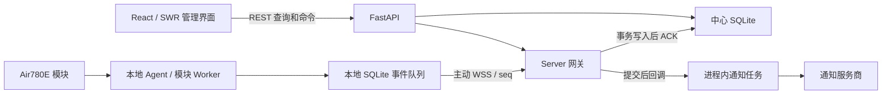

# 前后端优化方案总览

分析日期：2026-09-05。代码基线：`fe3008b`（`fix: preserve IMS bearer when data is disabled`）。第 1–6 节保留分析时的问题、验证结果和路线规划；后续实施记录见第 8 节及详细方案中的对应编号。

## 1. 结论与文档入口

项目适合继续采用 React 管理界面、单进程 FastAPI 网关、SQLite 中心库和本地 Agent 的部署结构。现有读路径在 10 万条短信下表现良好，优先级应是连接与数据正确性、通知持久化、前端异常反馈，然后才是并发性能和模块拆分。

详细实施说明分为两份：

- [前端详细优化方案](optimization-frontend.md)：请求与会话、短信分页、状态刷新、构建与 PWA、逐页体验、组件边界、测试验收。
- [后端详细优化方案](optimization-backend.md)：网关连接、设备身份、事件去重、通知 outbox、命令执行、SQLite、恢复、安全、接口契约与运维。

建议先完成下表的 P0 修复，再按依赖关系推进 P1。P0 表示下一轮开发首先处理，不表示已经确认生产事故；部分问题只在特定部署或数据条件下触发。

| 顺序 | 编号 | 问题及影响 | 证据强度 | 优先级 |
| --- | --- | --- | --- | --- |
| 1 | B01 | 相同 Agent ID 的新连接遭拒后，清理逻辑会注销原连接 | 隔离复现 | P0 |
| 2 | B02 | 数据库允许跨 Agent 同名设备，但命令和历史接口按名称定位，可能选错模块或合并历史 | 源码确认 | P0，多 Agent 同名时触发 |
| 3 | B03 / F03 | `sim_id=null` 会话读取实际省略 SIM 过滤，混入其他卡的同号码短信 | API 隔离复现＋前端调用链确认 | P0 |
| 4 | B04 | 去重表固定保留 7 天，清理后旧事件可再次应用 | 隔离复现 | P0，旧事件重放时触发 |
| 5 | F01 | 写请求的 401 被页面捕获后，不触发全局登录失效处理；退出也未显式清空业务缓存 | 源码确认 | P1 |
| 6 | F03 | 会话窗口每次增加 200 条，超过后端上限 2,000 条后返回 422 | 上限 API 复现＋前端调用链确认 | P1 |
| 7 | B05 | 通知异步任务没有持久化队列，崩溃或队列满时无法自动补投 | 源码确认，未注入真实推送故障 | P1；有通知必达要求时提升为 P0 |
| 8 | B07 | 数据库在线恢复未协调 Agent、通知、任务配置和现有会话等运行时状态 | 源码确认，后果需故障注入验证 | P1；频繁在线恢复时优先 |
| 9 | F02 / F04 | 多页面忽略读取错误；设备历史轮询但设备列表本身没有定时刷新 | 源码确认 | P1 |
| 10 | F05 | 路由已懒加载，但产物的入口 HTML 仍预加载图表 chunk，PWA 预缓存全部构建资源 | 本次构建产物确认 | P1 |

## 2. 分析范围与方法

阅读了 `frontend/src`、`server/src/hub_server` 的核心路径，核对 Agent 的事件缓冲、接收循环、命令处理，以及部署配置、CI、已有性能与可靠性文档。未读取 `.local/` 的业务数据和凭据，诊断使用临时 SQLite 数据库与合成消息。

本次包含静态分析、现有自动化测试、生产构建、10 万行基准和针对性复现。未执行真实串口命令、真实短信发送、外部通知投递、生产恢复或部署。未进行浏览器视觉验收、Lighthouse、浏览器内存采样或多客户端 HTTP 压测。因此：

- 源码能够确定的分支和边界标记为“源码确认”；复现输出单独列出。
- 端到端延迟、并发容量、实际移动端触控和对比度等仍是待测项。
- 文中的容量、性能目标和人日为建议验收预算，不是当前系统实测能力或交付承诺。
- 使用 ui-ux-pro-max 的定向 UX 检索辅助制定键盘焦点与弹窗检查项；React 性能检索两次未匹配，相关建议直接依据项目代码和构建产物，未采用未命中的技能输出。

## 3. 现有架构与值得保留的能力

| 层次 | 已有能力 | 优化中应保留的约束 |
| --- | --- | --- |
| 前端 | React 19、TypeScript、MUI、SWR、路由懒加载、手动分包、明暗主题、reduced-motion、部分组件可访问性测试 | 不重复建设路由懒加载、请求缓存、主题 token 和基础焦点样式 |
| Server | 会话认证、Agent Token 轮换、参数化 SQL、SQLite WAL、版本迁移及迁移前快照、流式 CSV | 不降低认证要求，不破坏迁移恢复与流式导出 |
| 事件链路 | `(agent_id, seq)` 去重与业务写入同一事务，提交后才 ACK；回滚及丢 ACK 重放测试 | 后续线程化和 outbox 必须保留事务与 ACK 顺序 |
| 查询 | 会话复合索引、范围趋势查询、约 360 点的设备历史聚合、日志分页 | 先扩展基准，再决定是否引入 FTS、聚合表或其他存储 |
| 通知 | 渠道复用、同渠道规则去重、重试、错误脱敏、并发任务上限、失败事件 | 持久化补投必须保留规则语义、损坏短信恢复片段和数据短信抑制逻辑 |
| Agent | 本地事件缓冲、任务离线执行、每模块 Worker、USB 重新枚举与自愈限频 | 不能把硬件超时等同于未执行，不能跨模块串行拖住 ACK |
| 工程 | Agent/Server 多 Python 版本 CI、前端 lint/test/build、安全及发布流水线 | 增量补齐真实用户路径测试，避免把现有测试称为缺失 |

主要集中模块的行数：`db.py` 2,344、`api.py` 1,251、`notify.py` 956、`gateway.py` 814；前端 `Messages.tsx` 1,187、`Notify.tsx` 1,128、`Devices.tsx` 918。行数用于识别职责集中区域，不能单独作为重构理由。

## 4. 本次验证结果

### 4.1 测试与构建

| 验证 | 命令及目录 | 结果 |
| --- | --- | --- |
| Server | `server/`：`.venv/bin/pytest -q` | 215 passed，32.41 秒；1 条 Starlette TestClient 依赖弃用警告 |
| Agent | `agent/`：`.venv/bin/pytest -q` | 340 passed，10.28 秒 |
| 前端 | `frontend/`：`npm test` | 14 个测试文件、101 项测试通过 |
| 前端静态检查 | `frontend/`：`npm run lint` | 通过 |
| 前端类型与构建 | `frontend/`：`npm run build` | TypeScript 与 Vite 构建通过 |

合计 656 项现有测试通过。测试通过说明已有覆盖内的行为稳定，不代表本文的新边界用例已经被覆盖。前端的 `pages/Messages.test.ts`、`Devices.test.ts` 主要验证辅助函数，不能等同于完整页面交互或浏览器测试。

### 4.2 构建体积

| 产物 | 原始大小 | gzip 大小 |
| --- | ---: | ---: |
| index chunk | 218.55 kB | 71.50 kB |
| react chunk | 43.30 kB | 15.65 kB |
| mui chunk | 409.10 kB | 125.92 kB |
| charts chunk | 380.10 kB | 110.54 kB |
| Messages 页面 | 15.98 kB | 5.93 kB |
| Devices 页面 | 18.04 kB | 6.02 kB |
| Notify 页面 | 18.93 kB | 6.64 kB |

构建后的 `dist/index.html` 含 react、mui、charts 三个 `modulepreload`。入口 JS 与三者 gzip 合计约 323.61 kB；这是产物加总，不是浏览器测得的传输量。PWA 输出为 25 项预缓存、1,151.78 KiB，不能据此认定所有资源都阻塞首次渲染，也不能认定 API 数据已被缓存。

### 4.3 10 万条短信基准

执行：`server/` 下 `PYTHONPATH=src .venv/bin/python benchmarks/messages.py --repeat 3 --json`。环境为 Linux x86_64、Python 3.13.14、SQLite 3.53.1，12 张 SIM、100,000 条短信，临时数据库 38,170,624 bytes。

| 路径 | 本次中位数 | 仓库既定阈值 | 结果 |
| --- | ---: | ---: | --- |
| 列表＋总数 | 2.393 ms | 75 ms | 通过 |
| 正文搜索＋总数 | 59.371 ms | 300 ms | 通过 |
| 单会话＋总数 | 0.838 ms | 75 ms | 通过 |
| 会话聚合 | 31.357 ms | 300 ms | 通过 |
| 30 天趋势 | 6.991 ms | 150 ms | 通过 |
| 365 天趋势 | 89.764 ms | 750 ms | 通过 |
| CSV | 1,007.983 ms，约 99,208 行/秒 | ≥15,000 行/秒 | 通过 |
| CSV Python 堆峰值 | 1.036 MiB | ≤32 MiB | 通过 |

查询计划确认单会话使用 `idx_messages_conversation`，趋势使用 `idx_messages_ts`，聚合仍存在覆盖索引扫描与临时排序。该基准不包含 HTTP、认证、JSON 编码、真实浏览器、并发写入和第三方网络耗时；不能把表中数字作为 API p95。

### 4.4 隔离复现记录

使用临时目录、模拟 Socket 和 TestClient，未连接实际 Agent。首次独立 TestClient 诊断在沙箱内未完成，终止后以 20 秒超时在获准环境重跑，正常退出。

| 用例 | 操作 | 实际输出与意义 |
| --- | --- | --- |
| 重复 Agent 连接 | 先登记 `audit-agent`，再向网关提交同 ID 的 hello | 新连接关闭码 4003；`original_still_registered=false`、数据库 `connected=0`，证明误注销 |
| 去重保留期 | 应用 seq=1，将其去重记录时间设为 7 天前，运行 purge，再重放 | 两次 `fresh=true`，消息行数变成 2；业务数据保留并不能阻止重复 |
| null SIM 会话 | 为同 peer 插入一条无 SIM、一条有 SIM 消息，按前端当前方式只传 peer 查询 | 返回 `sim_id=[1,null]`，证明当前读取条件包含两张身份 |
| 长会话上限 | 管理员调用 `/api/messages?limit=2200` | HTTP 422；结合前端 `reach += 200`，确认上限不一致 |

这些复现应转化为后续 PR 的永久回归测试，当前未把临时诊断脚本加入项目测试集。

## 5. 实施路线与依赖

估算口径：1 人日为一名熟悉项目的工程师约一个工作日，含代码审查、针对性测试和文档；不含等待真实硬件、第三方通知服务及上线窗口。以下为工作包估算，不应再与详细文档逐项相加。

| 阶段 | 工作包 | 交付物与退出条件 | 估算 |
| --- | --- | --- | ---: |
| 第一阶段 | B01–B04 正确性；F01–F03 异常与边界 | 新复现用例纳入测试；同名设备、null SIM、超 2,000 条会话有明确行为；旧事件不重复入库 | 10–16 人日 |
| 第二阶段 | B05 通知持久化；B06/B08 执行与 ACK；F04 数据刷新 | 重启补投、队列背压、命令未知状态可追踪；ACK 不被扫描阻塞 | 10–16 人日 |
| 第三阶段 | B07 恢复流程、B10 安全入口、B11 契约；F05/F06/F08 | 恢复可回退，敏感响应收敛，契约检查及首屏预算入 CI | 10–16 人日 |
| 第四阶段 | B09/B12 观测和查询优化；F07/F09/F10 逐页体验及端到端测试 | 组合负载报告、关键浏览器流程、移动端验收记录 | 8–12 人日 |

完整方案约 38–60 人日。实际应逐工作包验收和重新估算，优先交付第一阶段；不要求完成全部方案后才发布。

依赖关系：B02 设备身份和 B03 会话过滤先于相应前端迁移；B04 序列代际与 B05 outbox 共同决定恢复一致性；B06 命令作业状态先于 F06 的“刷新后继续查看”；B11 响应模型先于自动生成前端 DTO。模块拆分随对应工作包推进，避免一次大范围搬迁掩盖行为变化。

建议以可单独回滚的 PR 切分：连接所有权、SIM 过滤、设备 ID、会话分页、去重协议、会话失效、通知 outbox、命令作业、恢复维护模式、契约及构建。涉及 Agent 协议的变更遵守[同版本部署约束](deploy.md)，先完成 Server/Agent 配套测试，再安排同批升级。

## 6. 验收与发布门槛

### 6.1 必须成立的业务不变量

1. 未提交的入站事件不 ACK；已提交事件重复发送不会重复入库。
2. 同名不同 Agent 的设备，状态和命令目标可唯一定位。
3. `sim_id=null`、指定 SIM、全部 SIM 三种查询语义彼此独立。
4. 通知待办在进程重启后可恢复；超过重试预算进入可见失败状态。
5. 短信发送超时显示“结果未知”，不自动重发可能已经执行的硬件命令。
6. 退出、登录失效和恢复后，页面不继续展示旧会话的缓存短信或渠道密钥。
7. 恢复失败可回到恢复前完整状态；已被 Agent 清除的历史 ACK 数据不承诺可重建。

### 6.2 建议性能预算

先固定硬件、数据集、浏览器与测试脚本，再启用绝对阈值：

| 指标 | 建议预算 | 验证方法 |
| --- | --- | --- |
| 10 万行读路径 | 不突破仓库当前基准阈值 | 复用 `benchmarks/messages.py`，保留机器信息和查询计划 |
| 普通读 API | 固定测试机组合负载下 p95 ≤200 ms | 20 个模拟浏览器＋状态写入；单列搜索与长扫描 |
| 网关 ACK | 固定环境稳定负载 p95 ≤100 ms；无超过 1 秒的非故障阻塞 | 记录到达、事务提交、ACK 时间；另测回放和磁盘受限场景 |
| 通知排队 | 正常负载首投等待 p95 ≤2 秒 | 仅测排队至首投开始，不混入服务商耗时 |
| 登录入口资源 | 消除图表预加载，入口相关 gzip JS 争取 ≤250 kB | 构建依赖图＋冷缓存网络记录，区分 SW 后台预缓存 |
| 页面交互 | INP p75 ≤200 ms、CLS ≤0.1 作为目标 | 实际浏览器采样；未完成采样前不宣称已达标 |
| 长会话 | 10,000 条可分批完整访问，单次历史请求固定页大小 | 在持续收信下验证无重复、无缺页、滚动锚点稳定 |

共享 CI runner 保留趋势及宽松回归比例；稳定测试机或发布验收承担绝对延迟门槛。硬件功耗、网络注册和运营商送达不纳入 Web API 的延迟承诺。

### 6.3 暂不优先实施

- 当前没有数据库容量失败证据，暂不迁移 PostgreSQL、Redis 或微服务；先解决共享锁、慢任务和可观测性。
- 保留 MUI、SWR 和已有主题；不以更换框架作为体积或可维护性的默认解法。
- 全文索引、会话物化表、跨进程网关和浏览器 SSE 作为有测量触发条件的后续选项。
- 本次未进行依赖漏洞审计；TestClient 弃用警告需要独立核对锁定版本与上游迁移指导，不据此直接修改依赖。

## 7. 维护方式

后续实现时在对应编号下记录 PR、验证命令、性能结果和上线日期；当行为已修改，应同时更新“现状”与证据基线。现有[性能文档](performance.md)、[可靠性文档](reliability.md)、[协议文档](protocol.md)仍作为基线入口，避免出现两套相互矛盾的验收规则。

## 8. 实施记录

### 2026-09-05：Agent 命令并发与通知重试

本轮在已有工作区改动上继续实现 B08 §9.2：有界命令队列使长扫描不再阻塞 ACK 或其他
设备，同设备顺序、断线时的未执行/执行中边界和停机前回执落盘均有自动化覆盖。具体
限额和协议行为见[后端方案 B08](optimization-backend.md#92-agent-接收循环被命令阻塞)
及[协议文档](protocol.md)。

同时修复现有 B05 outbox 的重试等待函数缺失，以及有效租约导致立即重复轮询的问题。
通知后台重试与租约接管使用 mock 服务验证，没有发送外部通知。

验证结果：

| 范围 | 命令（在对应子目录运行） | 结果 |
| --- | --- | --- |
| Agent 全量 | `.venv/bin/pytest -q` | 357 passed，10.23 秒 |
| Server 全量 | `.venv/bin/pytest -q` | 259 passed，39.49 秒 |
| Python 静态检查 | Agent、Server 分别运行 `.venv/bin/ruff check .` | 均通过 |
| Agent 断网重放 | `.venv/bin/pytest -q tests/test_link.py --fault-cycles 100` | 10 passed，丢 ACK 重启场景执行 100 个故障循环 |
| 提交前前端验证 | `npm test`、`npm run lint`、`npm run build` | 17 个测试文件、164 项测试通过；lint、类型检查与生产构建通过 |

Server 保留 1 条已有的 Starlette TestClient 依赖弃用警告。另修正手动通知重试的审计用例：
该场景显式禁用自动重试，确保首投失败后进入人工重试状态，再验证投递成功与操作审计。

本轮仅完成上述工作包；任务版本回执随后按下节推进。B06 持久化命令作业、B08 §9.1
数据库执行调度仍需继续推进。尚未部署，也未进行真实串口或运营商长扫描验收。

### 2026-09-05：任务配置同步闭环

B08 §9.3 的配置同步已完成：Server 保存期望与已应用版本，Agent 在本地事务中保存任务、
revision 和可靠回执，Server 校验回执后更新状态，并后台重试未确认配置。离线编辑、发送
失败和应用失败均有明确状态；运维中心展示同步结果，手动运行校验已应用 revision。
完整语义见[后端方案 §9.3](optimization-backend.md#93-任务同步闭环)与[协议文档](protocol.md)。

提交前验证结果：

| 范围 | 命令（在对应子目录运行） | 结果 |
| --- | --- | --- |
| Agent 全量 | `.venv/bin/pytest -q` | 367 passed，10.81 秒 |
| Server 全量 | `.venv/bin/pytest -q` | 272 passed，44.59 秒；1 条已有 TestClient 弃用警告 |
| 前端全量 | `npm test` | 17 个测试文件、164 项测试通过 |
| 静态检查与构建 | Python `.venv/bin/ruff check .`；前端 `npm run lint`、`npm run build` | 通过 |
| 浏览器验收 | 1440px、375px 视口 | 状态标签正常，无水平溢出或页面错误 |

schema 从 16 升至 17，需两端同步升级，尚未部署。后续继续推进 B06 持久化命令作业和
B08 §9.1 数据库执行调度；任务执行的 run_id/跨重启幂等仍计入 B06，配置回执不替代执行回执。
